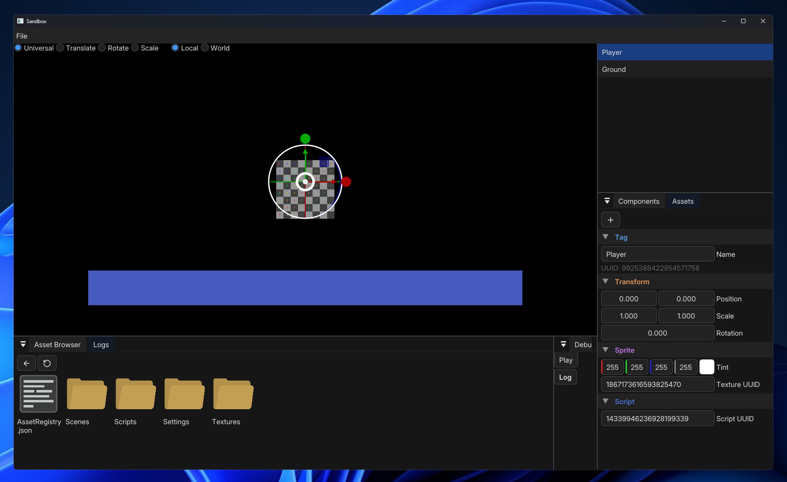

<div class="center">
  # Cobalt Engine <br>
  
</div>
Cobalt Engine is a simple 2D game engine written in C++, using OpenGL as its graphics API.
> [!NOTE]
> The engine is currently in an early stage and not yet capable of making games.

## Platform support
- Windows
- Linux

## 0.1 Roadmap
The primary goal for version 0.1 is to make the engine capable of creating a simple game through its editor.
- [ ] Asset management
- [ ] Input
- [ ] Scripting
- [ ] Audio
- [ ] Physics
- [ ] Runtime GUI
- [ ] Building and Packaging
- [ ] Project launcher

## Building
#### Requirements
- **CMake** ≥ 3.24
- **C++ Compiler** supporting **C++23**
  - **MSVC** (Visual Studio 2022)
  - **Gcc** ≥ 11
  - **Clang** ≥ 18
- Ninja *(optional)*

Clone the repository
``` sh
git clone --recursive https://github.com/Resongeo/Cobalt-Engine
```
Change directory
``` sh
cd Cobalt-Engine
```

#### If you’re building from an IDE, use its built-in CMake tools to configure and build the project. For manual builds, run the following commands:

Create a build directory and generate the build files:
``` sh
cmake -B build
```
Build the project:
``` sh
cmake --build build
```

## Dependencies
- [AngelScript](https://github.com/anjo76/angelscript) - Extremely flexible cross-platform scripting library
- [Catch 2](https://github.com/catchorg/Catch2) - Unit testing framework
- [EnTT](https://github.com/skypjack/entt) - Fast and reliable ECS
- [Glad](https://github.com/Dav1dde/glad) - OpenGL function loader
- [Glm](https://github.com/g-truc/glm) - Mathematics library for graphics applications
- [Dear ImGui](https://github.com/ocornut/imgui) - Immediate-mode GUI library for the editor
- [ImGuizmo](https://github.com/cedricguillemet/imguizmo) - A collection of Dear ImGui widgets for 3D manipulation and more
- [SDL3](https://wiki.libsdl.org/SDL3/FrontPage) - Simple DirectMedia Layer for low level multi-media
- [simdjson](https://github.com/simdjson/simdjson) - Fast json parser and serializer
- [spdlog](https://github.com/gabime/spdlog) - Fast C++ logging library
- [stb](https://github.com/nothings/stb) - Single-file public domain libraries
- [Toml++](https://github.com/marzer/tomlplusplus) - TOML config parser and serializer