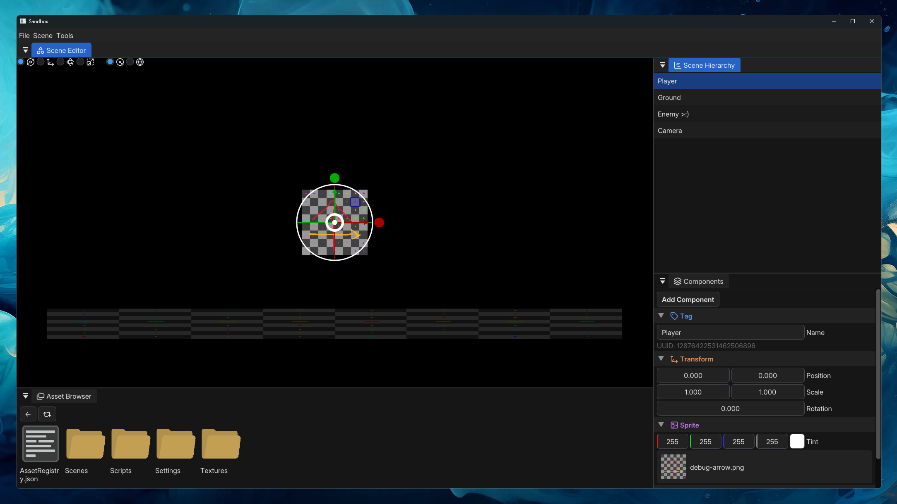

<div align="center">

# Cobalt Engine



[](LICENSE)
[](https://github.com/Resongeo/Cobalt-Engine)
[](https://www.opengl.org/)

</div>

Cobalt Engine is a simple 2D game engine written in C++, using OpenGL as its graphics API.

> [!NOTE]
> The engine is currently in an early stage and not yet capable of making games.

## Platform support
- Windows
- Linux

> [!NOTE]
> Only tested on Fedora Workstation 44 and CachyOS

## 0.1 Roadmap
The primary goal for version 0.1 is to make the engine capable of creating a simple game through its editor.
- [ ] Asset management
- [ ] Input
- [ ] Scripting
- [ ] Audio
- [ ] Physics
- [ ] Runtime GUI
- [ ] Building and Packaging
- [ ] Project launcher

## Building
#### Requirements
- **CMake** ≥ 3.24
- **C++ Compiler** supporting **C++23**
  - **MSVC** (Visual Studio 2022)
  - **Gcc** ≥ 11
  - **Clang** ≥ 18
- Ninja *(optional)*

Clone the repository
``` sh
git clone --recursive https://github.com/Resongeo/Cobalt-Engine
```
Change directory
``` sh
cd Cobalt-Engine
```

#### If you’re building from an IDE, use its built-in CMake tools to configure and build the project. For manual builds, run the following commands:

Configure the project:

```sh
cmake --preset debug
```

Build the project:

```sh
cmake --build --preset engine-debug
```

For a minimum size release build:

```sh
cmake --preset min-size-release
cmake --build cmake-min-size-release
```

## Dependencies
- [AngelScript](https://github.com/anjo76/angelscript) - Extremely flexible cross-platform scripting library
- [Catch 2](https://github.com/catchorg/Catch2) - Unit testing framework
- [EASTL](https://github.com/electronicarts/EASTL) - Electronic Arts Standard Template Library
- [enkiTS](https://github.com/dougbinks/enkits) - Task Scheduler for creating parallel programs
- [EnTT](https://github.com/skypjack/entt) - Fast and reliable ECS
- [Glm](https://github.com/g-truc/glm) - Mathematics library for graphics applications
- [Dear ImGui](https://github.com/ocornut/imgui) - Immediate-mode GUI library for the editor
- [ImGuizmo](https://github.com/cedricguillemet/imguizmo) - A collection of Dear ImGui widgets for 3D manipulation and more
- [Magic Enum](https://github.com/Neargye/magic_enum) - Static reflection for enums
- [optick](https://github.com/bombomby/optick) - C++ Profiler For Games
- [rpmalloc](https://github.com/mjansson/rpmalloc) - Optimized cross-platform lock free memory allocator
- [SDL3](https://wiki.libsdl.org/SDL3/FrontPage) - Simple DirectMedia Layer for low level multi-media
- [SDL3 Image](https://github.com/libsdl-org/SDL_image) - Image decoding for many popular formats
- [SDL3 Shadercross](https://github.com/libsdl-org/SDL_shadercross) - Shader translation library
- [simdjson](https://github.com/simdjson/simdjson) - Fast JSON parser and serializer
- [spdlog](https://github.com/gabime/spdlog) - Fast C++ logging library
- [stb](https://github.com/nothings/stb) - Single-file public domain libraries
- [Toml++](https://github.com/marzer/tomlplusplus) - TOML config parser and serializer